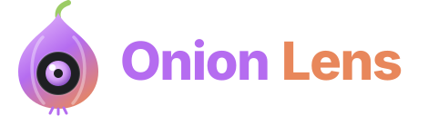

<p align="center"></p>

<p align="center"><b>Color picker &amp; screenshot tool for every browser</b><br>
Chrome · Edge · Brave · Opera · Vivaldi · Firefox · Safari</p>

---

Onion Lens is a browser extension that picks colors from any web page and captures screenshots. You can grab any pixel, convert it between 10 color formats, build and export palettes, and check accessibility. You can also capture the visible area, the full page, a dragged region or a single element, then annotate the image, copy it or save it.

It's built as one Manifest V3 codebase in plain JavaScript, with no build step, no dependencies, no tracking and no network requests.

## Features

### 🎨 Color picker
- **On-page eyedropper** with a zoomable pixel loupe:
  - mouse wheel zooms the loupe
  - arrow keys move one pixel at a time (Shift moves 10)
  - Shift+click picks several colors in a row
  - Esc exits
- **Sample size:** a single pixel, or the average of a 3×3 or 5×5 area.
- **10 formats:** HEX, RGB, HSL, HSV, HWB, CMYK, LAB, LCH, OKLAB, OKLCH. Click any value to copy it.
- **Any CSS color as input**, including names, `oklch()` and `color(display-p3 …)`. There's an opacity slider and the nearest CSS color name is shown.
- **Harmonies:** complementary, analogous, triadic, split complementary, tetradic, tints, shades and tones.
- **Gradient builder:** linear, radial or conic, with an angle control, the in-between steps, and copyable CSS.

### ♿ Accessibility
- **WCAG contrast checker:** AA/AAA results for normal text, large text and UI elements.
- **Auto-fix:** finds the closest lightness that passes AA (4.5:1).
- **Color vision simulation:** protanopia, deuteranopia, tritanopia and achromatopsia.
- **Element inspector:** hover any element to see its text, background and border colors, its contrast ratio and its font.

### 🔍 Page tools
- **Scan page:** lists every color the page uses, sorted by how often it appears.
- **Find on page:** click a scanned color to outline every element that uses it.
- Save a page's colors as a palette in one click.

### 📸 Screenshots
| Mode | What it captures |
|---|---|
| **Visible** | What's on screen |
| **Full page** | The whole page, scrolled and stitched together. Sticky headers appear only once |
| **Select area** | A box you drag. The page scrolls when you drag to an edge |
| **Element** | One div or container. Wheel or ↑/↓ moves to its parent or child. Captures the whole element even when it's taller than the screen |

- Optional **delay** of 3, 5 or 10 seconds, for capturing hover menus.
- After capture: **Edit**, **Copy to clipboard** or **Save picture**.
  - Pictures save as PNG or JPEG to `Downloads/Onion Lens/`.
  - Turn on "Ask where to save" to choose another folder, such as Pictures.

### ✏️ Editor
- Crop, rectangle, arrow, pen, highlighter, text, **pixelate/redact**, eyedropper, undo and redo.
- **Palette from the image**: 5 to 16 dominant colors, which you can save as a palette.
- **Paste or drop any image** to edit it or get its palette. You can also right-click an image on a page and choose *Extract palette from this image*.

### 💾 Saved
- History of the last 50 picked colors.
- Named palettes, exportable as **CSS variables, SCSS, Tailwind, JSON or a HEX list**.

## Keyboard shortcuts

| Keys | Action |
|---|---|
| `Alt+Shift+X` | Open popup |
| `Alt+Shift+C` | Pick a color |
| `Alt+Shift+S` | Screenshot an area |
| `Alt+Shift+F` | Screenshot the full page |

To change them, go to `chrome://extensions/shortcuts` in Chromium browsers. In Firefox, open the Add-ons page, click ⚙ and choose *Manage Extension Shortcuts*.

**Editor:** `C` crop · `R` rectangle · `A` arrow · `P` pen · `H` highlight · `T` text · `B` pixelate · `I` eyedropper · `Ctrl+Z` / `Ctrl+Shift+Z` undo/redo · `Ctrl+C` copy · `Ctrl+S` save

## Install

There's no build step. Load the folder directly.

### Chrome, Edge, Brave, Opera, Vivaldi
1. Open `chrome://extensions` (or `edge://extensions` in Edge).
2. Turn on **Developer mode**.
3. Click **Load unpacked** and select this folder.

### Firefox (121+)
1. Open `about:debugging#/runtime/this-firefox`.
2. Click **Load Temporary Add-on…** and select `manifest.json`.

### Safari (macOS)
```sh
xcrun safari-web-extension-converter /path/to/onion-color
```
Build the generated Xcode project, then enable the extension under **Safari → Settings → Extensions**.

## Package for stores

```sh
zip -r onion-lens.zip . -x '.git/*' -x '.remember/*' -x 'test.js' -x '*.zip'
```

You can upload the same zip to the Chrome Web Store, Microsoft Edge Add-ons, Opera add-ons and Firefox AMO.

## Development

```sh
node test.js                                   # color math checks
npx web-ext lint --ignore-files test.js        # Firefox / AMO lint
```

### Project layout

```
manifest.json      MV3 manifest shared by all browsers
background.js      capture, script injection, tile stitching, downloads, menus, shortcuts
colors.js          color parsing, conversions, harmonies, contrast, CVD simulation, palette extraction
picker.js          on-page eyedropper overlay (injected on demand)
shot.js            area/element selection, scroll stepping, inspector, find-on-page (injected on demand)
popup.html/css/js  toolbar popup
editor.html/css/js screenshot editor
db.js              tiny IndexedDB store that hands screenshots to the editor
theme.css          design tokens and base styles
fonts/  icons/     bundled assets (icons rendered from logo/logo.svg)
logo/              logo.svg, wordmark, 512 px PNG for store listings
```

### How it works
- **Same code in every browser:** `const api = globalThis.browser ?? globalThis.chrome`. The manifest declares both `background.service_worker` (used by Chrome) and `background.scripts` (used by Firefox). Each browser ignores the key it doesn't use.
- **Eyedropper:** reads pixels from a `tabs.captureVisibleTab` screenshot instead of the `EyeDropper` API. EyeDropper only exists in Chromium and closes the popup.
- **Full-page and element shots:** the page is scrolled one screen at a time and each step is captured. Captures are throttled to about 2 per second, Chrome's limit. The tiles are stitched on an `OffscreenCanvas`, and the original scroll position is restored afterwards.

## Privacy

Onion Lens collects nothing and sends nothing over the network.
- All data (colors, palettes, settings) stays in your browser's local extension storage.
- Screenshots exist only on your device.
- No host permissions are requested. `activeTab` grants access to the current tab only when you click the toolbar icon, press a shortcut or use the context menu.

## Limitations
- Browser pages (`chrome://`, `about:`, extension stores) can't be scripted. On those pages the toolbar badge shows `!`.
- Full-page shots taller than the browser's canvas limit (about 16k px) are cut off at the bottom, and the editor shows a note.
- Pages that scroll an inner container instead of the window are captured as the visible area only.

## License

[MIT](LICENSE) © 2026 n1th1n-19

The bundled fonts [Inter](https://github.com/rsms/inter) and [JetBrains Mono](https://github.com/JetBrains/JetBrainsMono) are under the [SIL Open Font License 1.1](fonts/).
